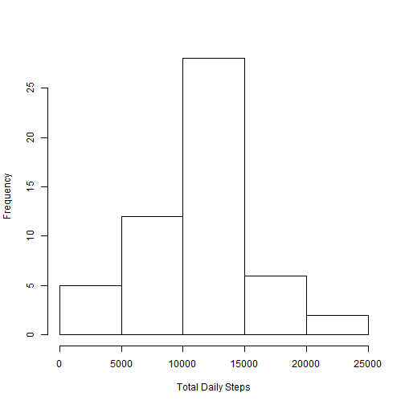
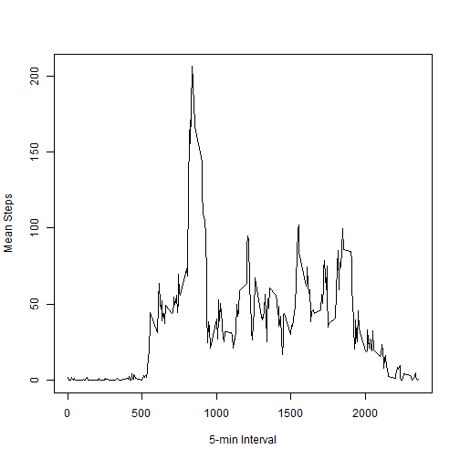
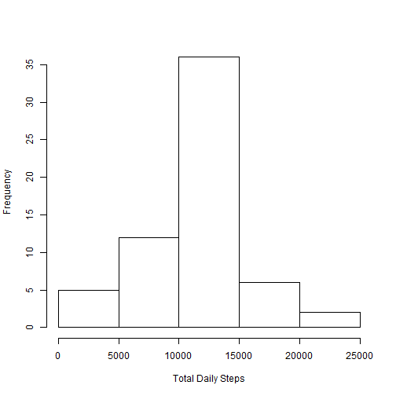
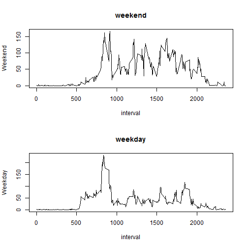

## Loading and preprocessing the data

- Load the data from the csv file.

```r
raw_df <- read.csv("./activity.csv", stringsAsFactors=F)
raw_df$date <- as.Date(raw_df$date)
```

- Process/transform the data into a suitable form.

```r
require("reshape2")
steps_df <- raw_df[!is.na(raw_df$steps),]
daily_df <- melt(tapply(steps_df$steps, steps_df$date, FUN=sum))
names(daily_df) <- c("interval","steps")
interval_df <- melt(tapply(steps_df$steps, steps_df$interval, FUN=mean))
names(interval_df) <- c("interval","steps")
```

## What is mean total number of steps taken per day?
- Create a histogram of the total number of steps taken daily

```r
par(mfrow=c(1,1))
hist(daily_df$steps, xlab="Total Daily Steps", main="")
```

 

- Calculate and report the mean and median total number of steps taken per day.

```r
steps_mean <- mean(daily_df$steps)
steps_median <- median(daily_df$steps)
```
The mean of the daily steps taken is 10,766 and the median is 10,765.

## What is the average daily activity pattern?

- Make a time series plot of the 5-minute intervals and the average number of steps taken, averaged across all days.

```r
plot(interval_df$interval, interval_df$steps, type="l", xlab="5-min Interval", ylab="Mean Steps", main="")
```

 

- Which 5-minute interval, on average across all the days in the dataset, contains the maximum number of steps?

```r
max_interval = interval_df$interval[interval_df$steps==max(interval_df$steps)]
```
The 5-minute interval with the maximum average daily number of steps is interval 835.


## Input missing values
- Calculate and report the total number of missing values in the dataset (i.e. the total number of rows with NAs)

```r
num_na <- length(raw_df$steps[is.na(raw_df$steps)])
```
The number of intervals with missing data is 2,304.

- Devise a strategy for filling in all of the missing values in the dataset. The strategy does not need to be sophisticated. For example, you could use the mean/median for that day, or the mean for that 5-minute interval, etc.

My strategy is to use the 5-minute interval means to fill in for the NAs.  To accomplish this, I need to change the intervals in the fill_df dataframe to a row number in the interval_df dataframe.

```r
fill_df <- raw_df
# Use the right two digits first in the interval...
interval_means <- 
    as.numeric(substr(fill_df$interval, 
                      nchar(fill_df$interval)-1, 
                      nchar(fill_df$interval))) / 5 + 1
# Then, if any, use the rest of the digits
interval_plus <- fill_df$interval[nchar(fill_df$interval)>2]
interval_plus <- 
    as.numeric(substr(interval_plus, 1, nchar(interval_plus)-2)) * 12
interval_means[nchar(fill_df$interval)>2] <- 
    interval_means[nchar(fill_df$interval)>2] + interval_plus
# Now use the interval_means vectors to replace any NAs
fill_df$steps[is.na(fill_df$steps)] <- 
    interval_df$steps[interval_means[is.na(fill_df$steps)]]
```

- Make a histogram of the total number of steps taken each day and calculate and report the mean and median total number of steps taken per day. Do these values differ from the estimates from the first part of the assignment? What is the impact of imputing missing data on the estimates of the total daily number of steps?

```r
daily_fill_df <- melt(tapply(fill_df$steps, fill_df$date, FUN=sum))
names(daily_fill_df) <- list("date","steps")
hist(daily_fill_df$steps, xlab="Total Daily Steps", main="")
```

 

```r
fill_mean <- mean(daily_fill_df$steps)
fill_median <- median(daily_fill_df$steps)
```
The new mean for daily steps with the NAs filled is 10,766 and the new median is 10,766.


## Are there differences in activity patterns between weekdays and weekends?

- Create a new factor variable in the dataset with two levels - "weekday" and "weekend" indicating whether a given date is a weekday or weekend day.

```r
fill_df$weekend <- weekdays(fill_df$date)
fill_df$weekend[fill_df$weekend == "Saturday" | fill_df$weekend == "Sunday"] <- "Weekend"
fill_df$weekend[fill_df$weekend != "Weekend"] <- "Weekday"
```

- Make a panel plot containing a time series plot (i.e. type = "l") of the 5-minute interval (x-axis) and the average number of steps taken, averaged across all weekday days or weekend days (y-axis).

```r
weekday_df <- 
    melt(tapply(fill_df$steps, 
                list(fill_df$interval,fill_df$weekend), 
                FUN=mean), id=c("interval", "weekday"))
# For some reason, the id argument is being ignored by melt
names(weekday_df) <- c("interval","weekday","value")
weekday_df <- dcast(weekday_df, interval~weekday, mean)
par(mfrow=c(2,1))
with(weekday_df, {
    plot(interval, Weekend, type="l", main="weekend")
    plot(interval, Weekday, type="l", main="weekday")
})
```

 
